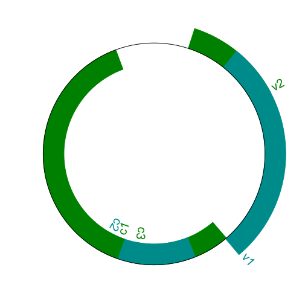

# ACM Research Coding Challenge (Spring 2021)

## Diagram

## Solution

I solved the prompt in Python. The libraries I used was ReportLab and BioPython which is used to parse the genbank file and create a genome digram. 

## References

https://biopython.org/docs/1.75/api/Bio.Graphics.GenomeDiagram.html
https://biopython-tutorial.readthedocs.io/en/latest/notebooks/17%20-%20Graphics%20including%20GenomeDiagram.html#A-top-down-example
https://biopython.org/wiki/SeqIO
http://biopython.org/DIST/docs/tutorial/Tutorial.html
